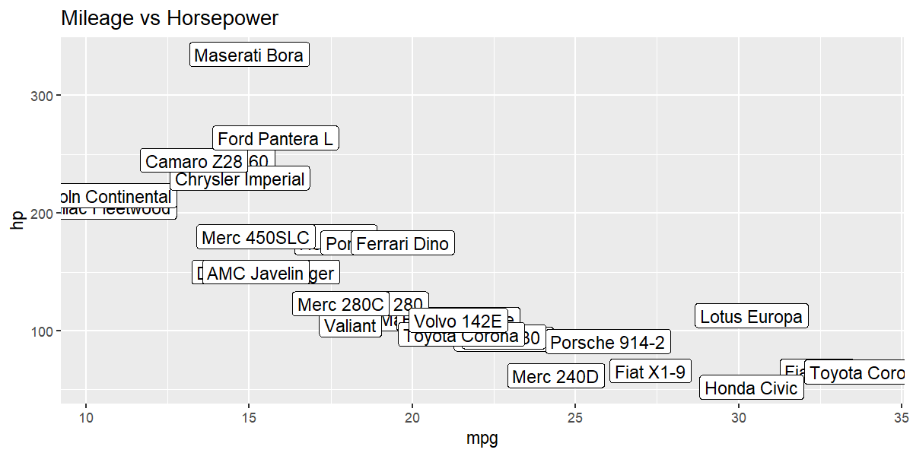

## Tidyverse example plot

    #> # A tibble: 6 × 12
    #>   car            mpg   cyl  disp    hp  drat    wt  qsec    vs    am  gear  carb
    #>   <chr>        <dbl> <dbl> <dbl> <dbl> <dbl> <dbl> <dbl> <dbl> <dbl> <dbl> <dbl>
    #> 1 Mazda RX4     21       6   160   110  3.9   2.62  16.5     0     1     4     4
    #> 2 Mazda RX4 W…  21       6   160   110  3.9   2.88  17.0     0     1     4     4
    #> 3 Datsun 710    22.8     4   108    93  3.85  2.32  18.6     1     1     4     1
    #> 4 Hornet 4 Dr…  21.4     6   258   110  3.08  3.22  19.4     1     0     3     1
    #> 5 Hornet Spor…  18.7     8   360   175  3.15  3.44  17.0     0     0     3     2
    #> 6 Valiant       18.1     6   225   105  2.76  3.46  20.2     1     0     3     1

